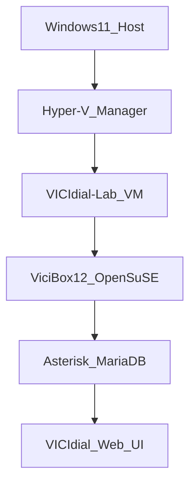

<div align="center">

# VICIdial Hyper-V Lab


<p>
  
  
  
</p>

</div>

---

## Project Showcase

PowerShell automation to deploy **VICIdial** (open-source call center) on **Windows 11** via **Hyper-V** and **ViciBox 12** ISO. Includes ISO download script, VM creation, and VM control utilities — ideal for lab/testing dialer infrastructure on a Windows host.

**Repository:** [github.com/mafzalkalwardev/vicidial-hyperv-lab](https://github.com/mafzalkalwardev/vicidial-hyperv-lab)

Built by **Muhammad Afzal Kalwar**.

## Architecture



## Key Scripts

| Script | Purpose |
|--------|---------|
| `01-download-vicibox.ps1` | Download ViciBox ISO |
| `02-create-hyperv-vm.ps1` | Create Hyper-V VM on D: drive |
| `03-vm-control.ps1` | Start/stop VM, get IP |

---

# VICIdial Setup on Windows 11 (Hyper-V)

VICIdial is a Linux call-center stack (OpenSuSE + Asterisk + MariaDB). It does **not** run natively on Windows. This folder contains scripts to install it in a **Hyper-V virtual machine** using the official **ViciBox 12** ISO.

## Quick start

### Step 1 — Download ViciBox ISO (no admin)

```powershell
cd D:\Vicidail
.\scripts\01-download-vicibox.ps1
```

### Step 2 — Create the Hyper-V VM (admin required)

```powershell
D:\Vicidail\scripts\02-create-hyperv-vm-admin.bat
```

### Step 3 — Install ViciBox inside the VM

1. Hyper-V Manager → start **VICIdial-Lab**
2. Boot menu → **Install ViciBox**
3. Login: `root` / `vicidial` (change on first login)
4. Run `vicibox-express` as root

### Step 4 — Access VICIdial

- Admin: `http://<VM-IP>/vicidial/admin.php`
- Agent: `http://<VM-IP>/agc/vicidial.php`

## VM Management

```powershell
.\scripts\03-vm-control.ps1 -Action start
.\scripts\03-vm-control.ps1 -Action stop
.\scripts\03-vm-control.ps1 -Action ip
```

## References

- [ViciBox 12 docs](https://docs.vicibox.com/en/latest/)
- [ViciBox ISO download](https://download.vicidial.com/vicibox/server/)

---

## About the Developer

**Muhammad Afzal Kalwar** — [@mafzalkalwardev](https://github.com/mafzalkalwardev) · [mafzalkalwardev.github.io](https://mafzalkalwardev.github.io)

<details>
<summary>SEO Keywords</summary>
Muhammad Afzal Kalwar, mafzalkalwardev, VICIdial Windows setup, Hyper-V call center lab, PowerShell automation Pakistan
</details>

---

<div align="center"><sub>Built by Muhammad Afzal Kalwar · FT Solutions</sub></div>
